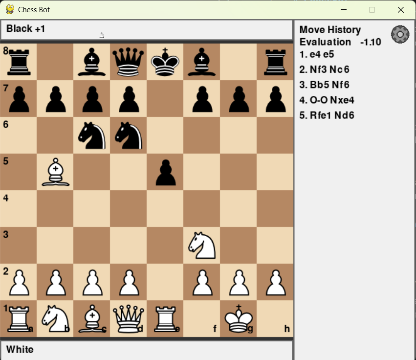

# ChessBot

A Pygame-based chess game with clean algebraic move history, smart disambiguation, check/checkmate detection, material tracking, pawn promotion UI, and a board flip option so you can play from White or Black's perspective.

## PSA

- When you run the engine, do it from the terminal rather than an IDE, as the engine uses a lot of RAM.
- If you are hell bent on running the engine from an IDE, make sure you have at least 16 GB of RAM or more, or go to the main file and lower the depth to 3.
- Also, unless you want the engine to take 5 minutes per move, close all Chrome tabs. And yes, I am working on optimizing the search function.

## Depth Vs Strength

- Red Squirrel currently performs a full alpha–beta negamax search with quiescence, tested up to depths 2 and 3 in Python. Despite the shallow depth ceiling (a limitation of Python’s speed, not the engine’s design), it already plays surprisingly strong chess.
- In testing against maximum-level Stockfish, Red Squirrel achieved ~73% accuracy at depth 2 (roughly equivalent to ~1800 Elo play) and pushed into the ~2100 Elo range at depth 3. The engine’s strength scales cleanly with depth, but Python becomes too slow to reliably reach depth 4+ without multi-minute think times.
- A future C++ core will allow deeper searches, faster node throughput, and a significant jump in playing strength, unlocking the engine’s full potential.

## Features

- Standard chess rules: legal move validation, check, checkmate, stalemate
- Castling, en passant, and pawn promotion (Q/R/B/N)
- Promotion UI appears on the promotion square (forced selection)
- Algebraic notation move history (e.g., `1. e4 e5 2. Nf3 Nc6`)
  - Includes captures (x), checks (+), checkmates (#), castling (O-O/O-O-O), and promotion (`=Q`)
  - Smart disambiguation (e.g., `Nbd2` vs `Nfd2`)
- Material tracking with captured pieces and relative advantage (e.g., `White +3`)
- Visual indicator when a king is in check (red square)
- Settings gear with “Flip Board” to play from either side
- Modular code structure for easier maintenance

## UI Overview

- Left: 8x8 board (60px squares) with labels
- Top/Bottom: Material advantage bars
- Right: Move history panel
- Top-right: Settings gear → Flip Board
- Promotion: A dropdown appears on the promotion square; select Q/R/B/N

## Getting Started

### Requirements

- Python 3.9+
- Pygame

Install Pygame:

```powershell
python -m pip install pygame
```

### Run the game

From the project folder:

```powershell
cd "\ChessBot"
python main.py
```

## How to Play

- Click a piece to select it. Legal destination squares are highlighted.
- Click a highlighted square to move.
- Captures, checks, and checkmates are tracked in the move history.
- Promotion: When a pawn reaches the last rank, a dropdown appears on that square. Click a piece (Q/R/B/N) to promote (you must choose to continue the game).
- Flip Board: Click the gear icon (top-right) → Flip Board. This flips the view only; rules and turns remain unchanged.

## Project Structure

```
ChessBot/
├─ main.py                    # Game loop, rendering, input, UI (gear, promotion)
├─ evaluation.py              # Static evaluation (material, PSQT, pawn structure, king safety)
├─ eval_smoke_test.py         # Quick script to sanity-check evaluation outputs
├─ engine/                    # Search (negamax with alpha-beta)
│  └─ search.py               # find_best_move and nega_max (+ simple make/undo)
├─ engine_smoke_test.py       # Try a shallow search from the starting position
├─ legal_moves.py             # Move generation, rules (check, mate, stalemate, castling, en passant)
├─ move_history.py            # Algebraic notation and history panel
├─ disambiguation.py          # Smart disambiguation for notation
├─ material_tracker.py        # Captures and relative material advantage
├─ chess_pieces/              # PNG assets for all pieces
│  ├─ white_*.png
│  └─ black_*.png
└─ README.md                  # This file
```

## Design Notes

- Display orientation is decoupled from rules. Internally:
  - White pawns move toward row 0; Black toward row 7.
  - Castling uses fixed king/rook squares by color.
- The view layer handles flipping (drawing and click mapping), so gameplay logic is consistent regardless of orientation.

## Troubleshooting

- "ModuleNotFoundError: No module named 'pygame'"
  - Install pygame: `python -m pip install pygame`
  - Ensure you’re using the same Python interpreter in VS Code as in your terminal.
- Window doesn’t fit screen
  - The window is 680x560. If it’s clipped, try maximizing or adjusting display scaling.
- Promotion dropdown off-screen
  - The dropdown auto-adjusts based on square position and board orientation. If you see a layout issue, please open an issue with a screenshot.

## Roadmap Ideas

- Player vs. Engine (Stockfish/UCI integration)
- Move undo/redo
- Timers and move clocks
- PGN export/import
- Per-square move hints and last move highlight

## Screenshots

You can add screenshots to the repo and link them here:

```
/docs/screenshot-1.png
/docs/screenshot-2.png
```

Then reference with:

```md

```

Contributions and suggestions welcome. Enjoy playing and hacking on ChessBot!

## Evaluation module (engine work-in-progress)

An extensible static evaluation lives in `evaluation.py` and currently includes:

- Material balance (centipawns)
- Piece-square tables (knights)
- Pawn structure (doubled, isolated, passed)
- Simple king safety (starting-square penalty while queens remain)

Sample outputs you should see (approximate):

- Kings only: 0
- Kings + white pawn only: around +95 (material +100 with small structure adjustments)
- Kings + black rook only: about -500
- Knight PSQT: center ~70 cp better than corner

Usage in code (from White’s perspective):

```python
from evaluation import evaluate
score = evaluate(board_state, 'w')
```

Note: `board_state` is the 8×8 matrix used in `main.py` with '.' for empty squares and 'P'/'p' etc. for pieces.

## Engine (Negamax + Alpha-Beta)

Basic engine lives in `engine/search.py` using:

- `find_best_move(board, side_to_move, depth, st)`
- `nega_max(board, depth, alpha, beta, colour, st)`

State (`SearchState`) carries castling flags and the en passant marker. The engine generates legal moves, applies them with simple make/undo, and calls `evaluate(board)` at leaves.

Try a shallow search from the starting position:

```powershell
python engine_smoke_test.py
```

Integration into the game loop is straightforward: when it's the engine's turn, call `find_best_move(...)` and then apply the chosen move. We can wire this up next if you want the bot to play automatically.
